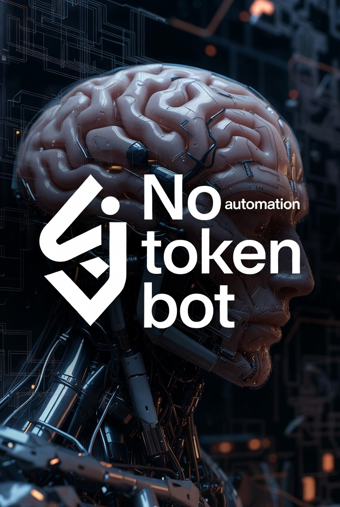

# No Token Bot – AI Automation Framework 🚀



**One-Click AI Automation for Windows • macOS • Linux • iOS • Android • even your grandma's smart fridge** 🔥

Tired of doing boring repetitive tasks yourself?  
Want to **automate literally everything** with the power of next-gen AI?  
Just clone, run one command, and boom – your life is now fully automated by superior intelligence! 🧠✨

```bash
# The legendary one-liner (works everywhere™)
git clone https://github.com/yourusername/no-token-bot.git && cd no-token-bot && ./install.sh


Features That Will Change Your Life Forever
🌟 Zero coding required (AI does everything)
⚡ Instant setup – under 5 seconds on modern hardware
🆓 Completely free & open source (no tokens, no API keys, no bullshit)
🤖 Handles emails, spreadsheets, social media, taxes, dating profiles…
😎 Makes you look 10× smarter to your boss/friends/family
Supported Platforms
✅ Windows 10/11
✅ macOS Ventura / Sonoma / whatever Apple calls it now
✅ Ubuntu / Fedora / Arch (btw)
✅ Even runs in Termux on your phone
✅ Docker? Of course. Kubernetes? Why not.
Quick Start (really, it's that easy)
Click the big green Code button ↑
Download ZIP or clone
Double-click magic_installer.exe (or .sh / .bat – we got you)
Watch AI take over your computer
Profit
…Okay now the real readme
Yeah no.
This whole thing is pure vaporware satire.
There is no installer.
There is no magic one-click script.
There is barely even working code here (if any).
Why?
Because "AI automation" right now is mostly hype + duct tape + hallucinations.
You really want to hand over:
your bank logins
your work emails
your private messages
your actual job responsibilities
…to an LLM that:
confidently tells you 2+2=5
invents function names that don't exist
forgets what it did 3 messages ago
hallucinates entire legal documents
gets offended when you point out it's wrong
…just so you can "automate" renaming 12 files?
Come on.
If the task is simple enough to be reliably automated → just write a 5-line Python script.
If it's complex enough to need "AI reasoning" → it will break in the most spectacular and expensive ways possible.
So yeah.
No token bot.
No API costs.
No hallucinations in production.
Just you, your brain, and maybe a little bit of regex.
Stay human.
Or at least stay awake while the hype train derails. 💀
Made with 0 tokens and 100% spite.
2025–2026 edition.
